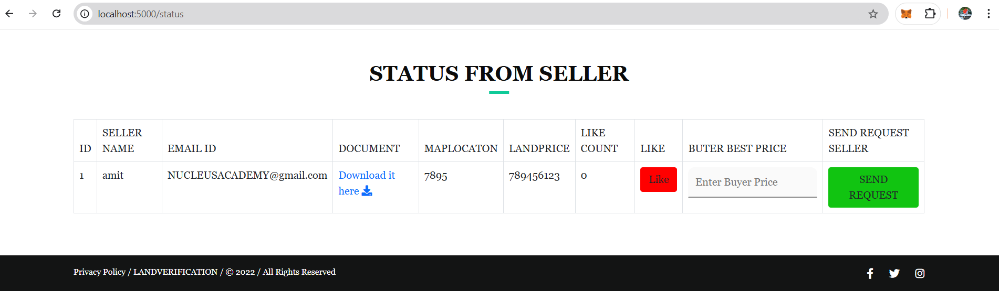

# Estate Management System

The **Estate Management System** is a web-based application that simplifies the management of real estate properties. Built using **Flask** as the backend framework, **MySQL** for the database, and **HTML/CSS** for the frontend, this project enables CRUD (Create, Read, Update, Delete) operations for managing properties, tenants, and transactions.

---

## Features

- **Property Management**: Add, view, edit, and delete property details.
- **Tenant Management**: Manage tenant profiles and their lease agreements.
- **Transaction Management**: Record and track rental payments and expenses.
- **User-friendly Interface**: Simple, responsive design for seamless interaction.
  
---

## Tech Stack

- **Backend**: Flask (Python)
- **Database**: MySQL
- **Frontend**: HTML, CSS

---

## Installation

1. **Clone the Repository**:
   ```bash
   git clone https://github.com/RoshanMundekar/-Estate-Management-System
   cd Estate-Management-System
   ```

2. **Set Up Virtual Environment**:
   ```bash
   python -m venv venv
   source venv/bin/activate   # For Linux/MacOS
   venv\Scripts\activate      # For Windows
   ```

3. **Install Dependencies**:
   ```bash
   pip install -r requirements.txt
   ```

4. **Set Up MySQL Database**:
   - Create a MySQL database (e.g., `estate_management`).
   - Import the SQL schema:
     ```sql
     mysql -u root -p estate_management < schema.sql
     ```
   - Update the `config.py` file with your database credentials.

5. **Run the Application**:
   ```bash
   flask run
   ```

6. **Access the Application**:
   Open a browser and navigate to `http://127.0.0.1:5000/`.

---

## Project Structure

```
Estate-Management-System/
├── static/
│   ├── css/             # Stylesheets
├── templates/           # HTML templates
├── app.py               # Main application entry point
├── config.py            # Configuration file (database settings)
├── requirements.txt     # Python dependencies
├── schema.sql           # Database schema
├── README.md            # Documentation
```

---

## CRUD Operations

- **Create**:
  - Add new properties, tenants, and transactions.
- **Read**:
  - View the details of properties, tenants, and transactions.
- **Update**:
  - Edit the existing records.
- **Delete**:
  - Remove records from the database.

---

## Screenshots

### ABOUT US


### Dashboard


### Admin


### Admin Verification


### Request seller


### payments


### Booking Lands Record


---

## Contributing

Contributions are welcome! Please follow the steps below:

1. Fork the repository.
2. Create a feature branch: `git checkout -b feature-name`.
3. Commit changes: `git commit -m 'Add new feature'`.
4. Push to the branch: `git push origin feature-name`.
5. Submit a pull request.

---

## License

This project is licensed under the [MIT License](LICENSE).

---

## Contact

For any queries or suggestions, feel free to reach out to:

- **Developer**: [Roshan Mundekar](mailto:rmundekar2000@gmail.com)
- **GitHub**: [rj](https://github.com/RoshanMundekar)
